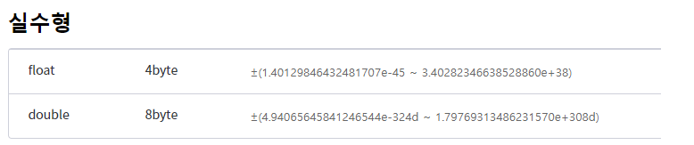

# 수업 2018 08.28 
 시험은 다 오픈북이고 javascript는 예전에 사용했던 두잇으로 사용

 

https://html5.jiny.dev/

https://infohojin.github.io/daelim_2019_1/

 

초록색 부분으로 나올때는 ctrl과 q를 눌러주면 된다. 

윈도우 다운로드 선택

7.2 선택후 

다운받은 php를 압축을 풀고 원래 폴더명을 'php'로 바꾼후에 C 의 root 에 붙여 넣기 한다. 

윈도우키와 R 키를 누른후 cmd입력후 창을 열고 이렇게 입력해주면 php가 실행된다. 설치를 따로 하는것이 아닌 압축만 풀어도 사용이 가능 하다. 

하지만 이 경우는 항상 php 폴더로 들어가야 하기 때문에 환경 변수를 잡아줘야 편하다. 

환경변수를 잡기 위한 작업을 한다. 

우리가 php 경로를 시스템 제어판에서 설정한다. 

경로 설정이 끝난다면 폴더로 들어가지 않아도 바로 입력하면 나오게 된다.

Php 를 vscode를 사용하면 코끼리 아이콘이 나온다. 

간단한 테스트를 진행 한다. 그리고 cmd창에서 열어보자 

[https://zetawiki.com/wiki/%EC%9C%88%EB%8F%84%EC%9A%B0_CMD_%EB%AA%85%EB%A0%B9%EC%96%B4_%EB%AA%A9%EB%A1%9D](https://zetawiki.com/wiki/윈도우_CMD_명령어_목록)

 이 수업에서는 명령어를 많이 쓸것 같으니 참고해 두자

 

Cmd창 청소하기 cls를 입력하면된다.

이렇게 하면 내가 사용하는 컴퓨터를 웹서버로 사용하겠다고 하는것 이다. 

무조건 디렉토리에 들어가있어야 한다. 

브라우저로도 띄워보자

입력해주고

이렇게 나온다 아직 아무것도 한 게 없기 때문에 이렇게 나오는 것이 맞다

그러니 우리가 만들었던 hello.php를 열어보도록 하자 

그러면 이렇게 브라우저로 열리게 된다.

왜 처음에는 404 에러가 나오고 두번째 에는 나오지 않는 것일까 

어떤 파일을 줘야하는지 몰라서 처음에는 index라는 파일을 제일 먼저 읽게 되기 때문이다. 

바로 이렇게 나온다. 그래서 항상 원하는 파일을 열고 싶으면 그 파일의 이름과 확장자 명까지 입력 해주어야 한다. 

웹서버의 포트는 기본 80포트를 사용한다. 

1. 

print 와 echo와 차이는 없다. 

 

그런데 차이점은 echo는 

화면에 출력만 해주고

Print는 화면에 출력이 되는지 확인을 할 수 있고 반환 값을 받을 수 있다. 

 

변수 

 

변수에 타입이 있는 이유는 변수에 따라 활용을 달리해서 메모리의 사용을 줄여보자(메모리를 효율적으로 사용해보자)는 의도에서 시작 되었다고 할 수 있다. 

### 오후 수업

이렇게 나오는 이유는 포인터 떄문에 그런것이다.

타이포라로 사용해보자

https://typora.io/ 들어가서 타이포라를 다운 

이런식으로 유용하게 사용할수 있다. 

https://hosa.tistory.com/214

위의 링크는 간단한 타이포라 사용법이다

깃을 사용해 보도록하자 

깃은 여러 작업과 수정을 통해서 각각의 버전관리를 쉽게 하기 위해 사용하는 중요한 툴이다. 

​	이렇게 사용할수 있는데 

깃을 사용할려면 일단 각각의 버전을 저장할 공간을 만들어야 한다. 그래서 우리는 .git이라는 폴더를 만들었다.

그 공간을 설정 하는 명령어 이다. 

파일을 보여주는 명령어를 사용해보면 방금 만든 폴더가 보이지 않는다 버전 관리 폴더는 숨김이 되어있기 때문에 

다른 명령어를 입력 해줘야 한다.

그러면 이렇게 우리가 만든 .git 폴더가 보인다. 

.git 폴더를 지우는 명령어 이다. 

**하지만** **rm -rf****는** **절대** **하면** **안되는** **명령어** **이다****.** 

**모든** **파일이** **지워지기** **때문에** 

**절대** **하면** **안된다****.** 

그러면 이제 readme.md 파일만 저장을 한 것이다. 

이제 캡쳐한 파일을 저장 하기 위한 커밋을 하기위한 방법 인데 누가 수정하고 언제 작업했는지에 대한 정보가 나와야 하기 때문에 

기록 해야 한다. 

수정한 사람의 아이디와 이메일을 추가 

그리고 이렇게 정보 입력 후 git commit -m 을 하게 되면 커밋이 완료 된것이다. 

**이제 깃 허브와 연동해보자**

 

깃허브에서 새로운 레퍼지토리를 만든후

드래그 해서 

깃 커맨드에 입력해보자 

